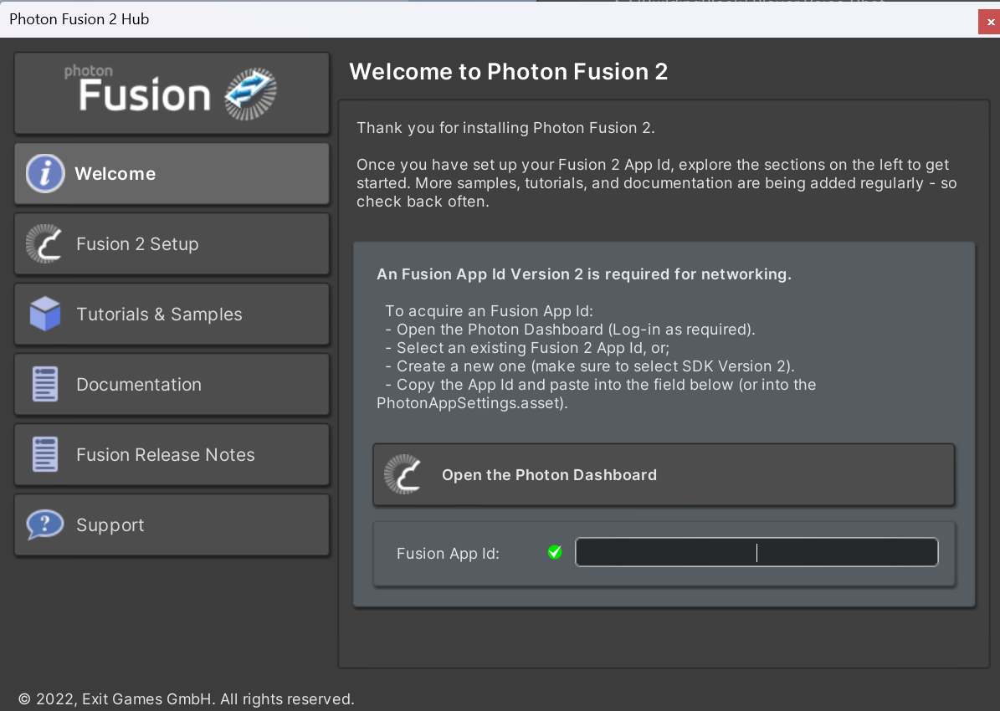
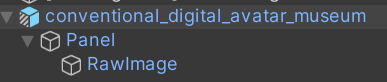
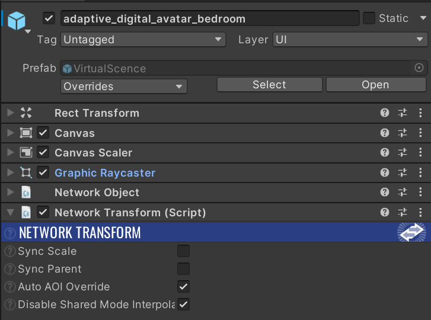
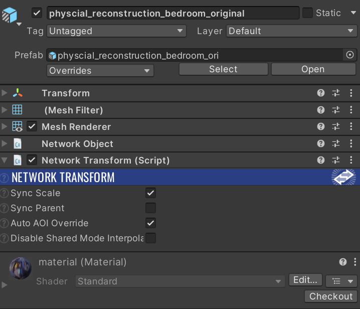
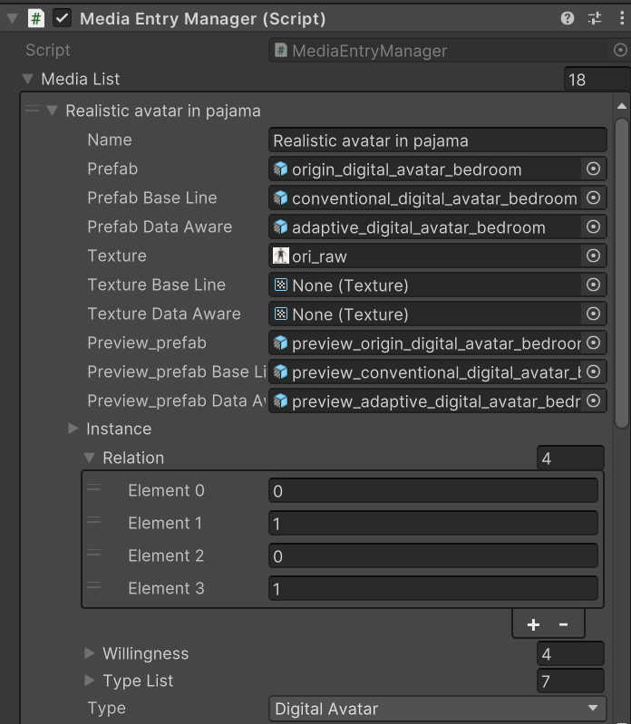

<!-- @format -->

# ShareAdapt

## Overview

ShareAdapt is a project that integrates adaptive privacy protection designs and
a context-matching privacy interface to manage spatial content. This README provides a step-by-step guide for setup, asset preparation, and adding media to the system.

---

## Network Synchronization

We use Photon Fusion for network synchronization in this project. To get started:

1. Obtain your Fusion App ID from [Photon](https://dashboard.photonengine.com/).

2. Add your App ID to `Tools > Fusion > Fusion Hub` as shown below:

---

## Asset Creation

Each media asset requires multiple prefabs to support conventional, original, and adaptive versions. Follow these steps to create the necessary prefabs:

### General Guidelines

- For **Visual Content**, **Mixed Display**, **Digital Avatar**, **Remote Perspective**, and **Spatial Image**:

  1. Create a prefab with a panel and raw image. Refer to the structure below or check the reference prefabs in `Assets > Prefabs > Template Prefabs`.

     

  2. Add `Network Object` and `Network Transform` components to the prefab.

     

- For **Physical Reconstruction** media:

  1. Add `Network Object` and `Network Transform` scripts to the 3D model, and create the prefab.

     

### Additional Requirements

- Provide a preview image of the media for display in the UI.

- Create "preview prefabs" for each media with controlled dimensions (width and height, ensuring width < 1.5m).

- Each media will correspond to:

  - 6 prefabs (3 main prefabs and 3 preview prefabs).

  - 1 preview image.

---

## Adding Media

1. Open the `GameControl > MediaEntryManager` script.

2. Add your media to the `MediaList` with the following fields:

   

   - **Name**: The name of your media.

   - **Prefab**: Original prefab.

   - **Prefab Base Line**: Conventional prefab.

   - **Prefab Data Aware**: Adaptive prefab.

   - **Texture**: Preview image.

   - **Preview_prefab**: Preview original prefab.

   - **Preview_prefab Base Line**: Preview conventional prefab.

   - **Preview_prefab Data Aware**: Preview adaptive prefab.

   - **Relation**: Sensitivity settings under different scenarios: `Parent`, `Supervisor`, `Spouse`, `Seller`.

     - `0`: Not sensitive (no protection notification triggered).

     - `1`: Sensitive (protection notification triggered).

   - **Type**: Choose a category for the media from the following:

     - Visual Content

     - Physical Reconstruction

     - Mixed Display

     - Digital Avatar

     - Remote Perspective

     - Spatial Image

---

## Notes

- For additional details or template references, consult the project’s `Assets` directory.

- Ensure all prefabs are correctly structured and include necessary network components for synchronization.

---
